# Remote Sensing in QGIS
An introduction to work with remote sensing data in QGIS.  
We are using the Semi-Automatic Classification Plugin.

#### Skills needed
- Basics in remote sensing
- Basics in QGIS
  - [What is GIS, and why use QGIS?](https://www.youtube.com/watch?v=8oEnJvLzDnQ) (5 min)
  - [QGIS for Absolute Beginners](https://www.youtube.cInstallo750m/watch?v=kCnNWyl9qSE) (30 min)
or the 

#### Technical requirments
- QGIS 3.10 or higher
   - If you need QGIS you can [download QGIS 3.16 &nbsp;Long Term Release here](https://qgis.org/en/site/forusers/download.html) 
&nbsp;&nbsp;&nbsp;&nbsp;&nbsp;&nbsp;&nbsp;&nbsp;&nbsp;&nbsp;&nbsp;&nbsp;  
- Account for the [Copernicus Open Access Hub](https://scihub.copernicus.eu/dhus/#/home) 
   - If you need an account you can [register here](https://scihub.copernicus.eu/dhus/#/self-registration) &nbsp;&nbsp;&nbsp;&nbsp;&nbsp;&nbsp;&nbsp;&nbsp;&nbsp;&nbsp;&nbsp;&nbsp;&nbsp;&nbsp;&nbsp;&nbsp;&nbsp;&nbsp;&nbsp;&nbsp;&nbsp;&nbsp;&nbsp;&nbsp;&nbsp;&nbsp;&nbsp;&nbsp;&nbsp;&nbsp;&nbsp;&nbsp;&nbsp;&nbsp;&nbsp;&nbsp;&nbsp;&nbsp;&nbsp;&nbsp;&nbsp;&nbsp;&nbsp;&nbsp;&nbsp;&nbsp;&nbsp;&nbsp;&nbsp;&nbsp;&nbsp;&nbsp;&nbsp;&nbsp;&nbsp;&nbsp;&nbsp;&nbsp; 

 &nbsp;

**Hint:** To ease the installation of the requirements use [*ANACONDA*](https://www.anaconda.com/products/individual).  
&nbsp;&nbsp;Create an environment i.e. *rs4gis* and install 
  - python 3.8, 
  - [Numpy](https://anaconda.org/anaconda/numpy), 
  - [SciPy](https://anaconda.org/anaconda/scipy), 
  - [Matplotlib](https://anaconda.org/conda-forge/matplotlib) and 
  - [QGIS](https://anaconda.org/conda-forge/qgis)
 
###### Here you can find two tutorials to install the software Anaconda
- [How to install Anaconda](https://www.youtube.com/watch?v=D1iSy8fhsl0&list=PL3NiwHdo_mtBr7WgiZEJ1eCn9G93N71zc)
- [How to install QGIS with Anaconda](https://www.youtube.com/watch?v=AtnttogusIU&list=PL3NiwHdo_mtBr7WgiZEJ1eCn9G93N71zc&index=2)

 

---

 

## Our goal for today

### Using GIS and Remote Sensing tools to proof why the World Heritage Site [Abu Mena](https://whc.unesco.org/en/list/90) is in Danger

*Background knowledge:* To be part of the **World Heritage List**, sites must be of **outstanding universal value**.
The List of **World Heritage in Danger** is designed to inform the international community of conditions which **threaten the very characteristics for which a property was inscribed** on the World Heritage List, and to encourage corrective action.

  

 
 

### The steps to achieve our goal
1. Install the  [Semi-Automatic Classification Plugin](https://fromgistors.blogspot.com/p/semi-automatic-classification-plugin.html) for QGIS
2. Download [Sentinel-2](https://blogs.fu-berlin.de/reseda/sentinel-2/) data
3. [Preprocess](https://rscc.umn.edu/lessons/lessonpre) the Sentinel-2 data
4. Calculate [NDVI](https://www.dlr.de/eoc/en/desktopdefault.aspx/tabid-9142/19518_read-45426/) & [NDWI](https://foodsecurity-tep.net/node/214)
5. Perform an [image classification](https://gisgeography.com/image-classification-techniques-remote-sensing/)

 

## What is the Semi-Automatic Classification Plugin?

**The Semi-Automatic Classification Plugin (SCP) is a free open source plugin for QGIS that allows supervised classifications of remote sensing data and offer functionalities to download, pre- and postprocesss imagery.**

The overall objective of SCP is to provide a set of functions for raster processing to enable an automatic workflow and ease generation of land cover classifications, especially for beginners of remote sensing methods (Congedo Luca 2020).

 

  <a href="https://www.youtube.com/watch?v=bzynTxwOcYQ&t=65s">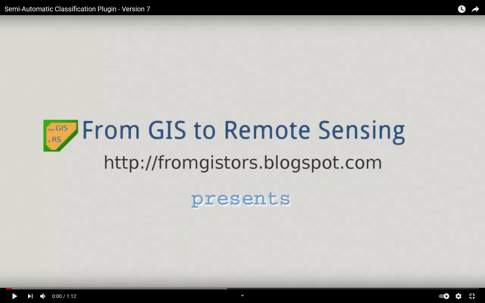</a>

&nbsp;

 

     

Search and download is available for ASTER, GOES, Landsat, MODIS, Sentinel-1, Sentinel-2, and Sentinel-3 images. Several algorithms are available for the land cover classification. The SCP requires the installation of GDAL, OGR, [Numpy](https://numpy.org/install/), [SciPy](https://www.scipy.org/) and [Matplotlib](https://matplotlib.org/). Some tools i.e. the Random Forest classifier require also the installation of [ESA's SNAP](https://step.esa.int/main/toolboxes/snap/) (Congedo 2020).

 
###### If you want to have more detail read:   
*Congedo Luca (2020). Semi-Automatic Classification Plugin Documentation. DOI: http://dx.doi.org/10.13140/RG.2.2.25480.65286/1*
###### Or have a look on the SCP websites
- *[SCP blog](https://fromgistors.blogspot.com/)*

---

  
### The steps to achieve our goal
1. Install the  [Semi-Automatic Classification Plugin](https://fromgistors.blogspot.com/p/semi-automatic-classification-plugin.html) for QGIS
2. Download [Sentinel-2](https://sentinel.esa.int/web/sentinel/missions/sentinel-2) data
3. [Preprocess](https://rscc.umn.edu/lessons/lessonpre) the Sentinel-2 data
4. Calculate [NDVI](https://www.dlr.de/eoc/en/desktopdefault.aspx/tabid-9142/19518_read-45426/) & [NDWI](https://foodsecurity-tep.net/node/214)
5. Perform an [image classification](https://gisgeography.com/image-classification-techniques-remote-sensing/)

  
 

## 1. Install the Semi-Automatic Classification Plugin (SCP)
 
  
Open this [video](https://www.youtube.com/watch?v=R613_HqT4qo) in a new tab (30 sec) and follow the instructions to install the SCP plugin.
  

  <a href="https://www.youtube.com/watch?v=R613_HqT4qo">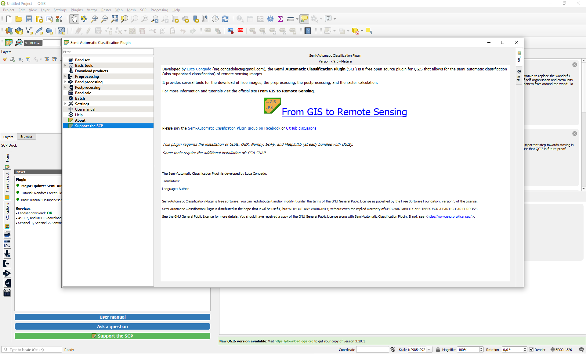</a>

  
 
 
  
  
## 2. Download Sentinel-2 data

 - After installing the SCP take care that the plugin is activated. &nbsp;&nbsp; 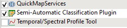 
 - Start to open the *Download products* tab of the SCP with &nbsp;&nbsp; 

###### The *Download products* tab have 3 subtabs: 
  - I. *Login data* 
  - II. *Search* 
  - III. *Download options*

 
  
###### Let's start with the I. *Login data* tab

> 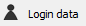 
> Login Sentinels  
> Service: https://scihub.copernicus.eu/apihub  
> User & Passwor: [Your personal account](https://scihub.copernicus.eu/dhus/#/self-registration)  

###### Now we continue with II. *Search* tab
> 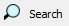 
>    - Select a "*Product*"  
>   - Set a "*Date from*"  
>    - Define "*Max cloud cover*"  
>    - Set an rectangular area of interest with &nbsp;   
>      - left-hand click = upper left corner  
>      - rigth-hand click = lower rigth corner  
 
*Hint: Select an appropriate Sentinel-2 scene i.e. the Abu Mena image from 6 April 2021* 

###### With tab III. *Download options* we are able to download the data directly in QGIS 
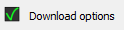  
>  - the check boxes of all Sentinel-2 bands need to be activated

   
  
###### Here you can find a video tutorial (5 min). Open this video in a new tab.

  

 

## 3. Create band set / Preprocess Sentinel-2 data

Open the *band set* window with &nbsp; 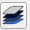 
> To update the *Single band list* click on  &nbsp;  
> Now the layers of the QGIS project are visible in the *Single band list* 
> Highligth the Sentinel-2 bands and add it to the *Band set definition* with &nbsp;  
> - The *Band set 1* now includes the Senintel-2 bands.  
> - Set the correct satellite setting to the band list via *Wavelength quick settings*  
> - To create a *band set* check the "Create raster of bands (stack bands)" option within the *Band set tools*

  

###### After preprocessing your data can look like these examples:
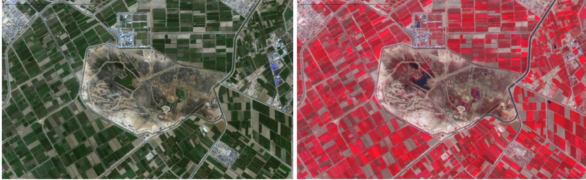
  
 
   
## 4. Calculate NDVI & NDWI
 

The **Normalized Difference Vegetation Index (NDVI)** is an indicator of healthy vegetation and thus closely linked to vegetation density and productivity (Tucker & Sellers 1986). The NDVI is calculated using the spectral reflectance measurements of the red and infrared (NIR) wavelength and can range from -1 to +1.

> NDVI = ( NIR – red ) / ( NIR + red )
  
 

The **Normalized Difference Water Index** is sensitive to the water content of vegetation and is similar to the NDVI. High NDWI values indicate a high water content of the vegetation. (Gao, B.C., Remote Sensing of the Environment, p.257(1996)). For Sentinel-2 data the NDWI needs Band 8 (NIR) and Band 12 (MIR). 
or the 
The NDWI results from the following equation: 
> NDWI = ( NIR - MIR ) / ( NIR + MIR ) 

  
  
To calculate a spectral index with the SCP use the &nbsp; 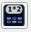
> To update the *Band list* click on  &nbsp;  
> - With double click you can add a band to the expression field
> - On the lower rigth side are the operators, i.e. +
> - Set the *Extent* to *Same as* one of the used bands
> - Use the formula above to calculate the NDVI & NDWI

 
  
  
###### After preprocessing your data can look like these examples:
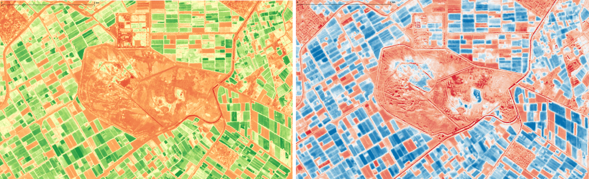
  
 
 

#### Have a look on the whole Sentinel-2 scene. What show us the NDVI?  
  
 
  
#### Are there differences of the NDVI & NDWI?
  
   
  
#### Have a look on Abu Mena. Can you explain the difference between the two spectral indices?  
    

 
 

## 5. Perform a classification

The SCP offers a set of useful tools during the classification process, i.e. the preview.
  
The video below will show you how to classify a satellite image. This includes:  
- Create training data
- Show spectral signature
- Preview the classification and compare different classifiers
- Classify the image
  
###### Here you can find a video tutorial (5 min). Open this video in a new tab.

  <a href="https://www.youtube.com/watch?v=LmDcVCeX7do&t=6s">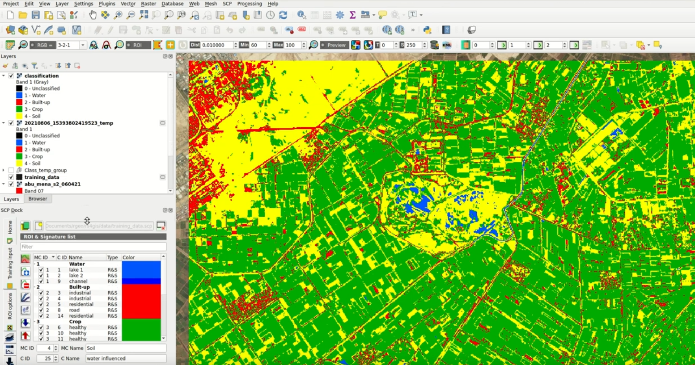</a>

 
  
 
 

#### Which classes show the highest errors or rather are difficult to distinguish?
###### Hint: Use the spectral signature graph  

 
  
  
#### Which classes show a wide range of values?  

  

 
  
  
---   
     

 
 
 

  

